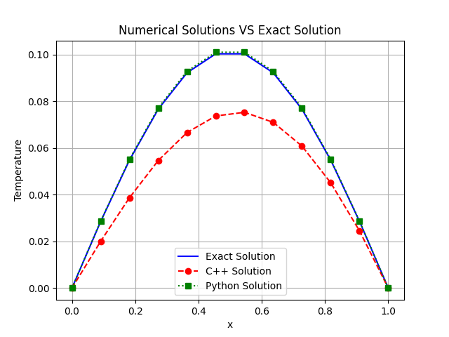

# Thomas Algorithm for heat diffusion problem

The track for this exam project can be found [here](https://github.com/pcafrica/advanced_programming_2023-2024/blob/main/exams/2024-02-13/part2.md).

## Code organization
A module called moduleH is created using the header and source files in the folder MatrixModule; the main file is in the folder called main; a CMake and a setup.py are provided and will be explained later on. When executing the main, a folder `images` containing the plots is created.

## 
This readme is still to be finished

<p align="center">
  <br>
 Numerical Solutions VS Exact Solution
</p>

## CMake and libraries
A CMake for the creation of the modules is provided. Also a setup.py is provided, creating a Python package easily installable via pip.
Some Python packages were used: NumPy, MatPlotLib tabulate. They can be installed with `pip install [names] --user`.<br>
NumPy is used for mathematical operations; MatPlotLib for plotting; tabulate to create a table of some results.<br>
Since the library Boost is shared, it's linked in the CMake to compile; while the library muparserx is only used in the second module and therefore only linked if that module is compiled.  
Everyone in this field should have these libraries installed, if not so, Boost can be downloaded from [the original webpage](https://www.boost.org/) and muparserx from [this zip file on GitHub](https://github.com/beltoforion/muparserx/archive/refs/tags/v4.0.12.tar.gz).  
Since most Boost libraries are header-only, often there is nothing to build; this is our case. While for muparserx it's required to create a folder in which to run the cmake.  

## How to compile
A CMake and a setup.py are provided in the main directory. Setup.py implicitly calls CMake, thus everything is ready writing:
```bash
python setup.py install --user
```
Or even better just using pip
```bash
pip install --user .
```
Lastly, to compile the main:
```bash
python main/main.py
```