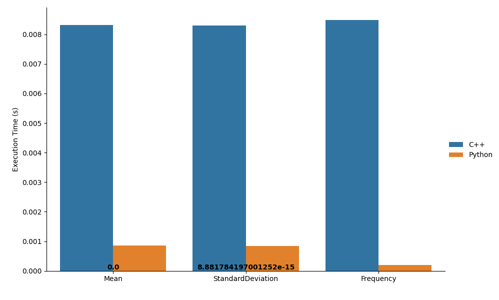
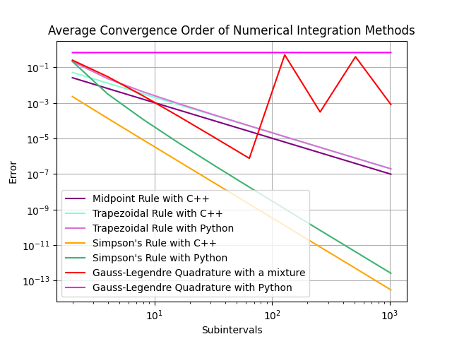

# part2_Serafino_Sara_SM3400292

This exam project has the goal of INSERISCI QUA in C++ and integrating it with Python using pybind11.

## Code organization
For each module there is a folder which separates source files from header files; the main file is in its folder called main; a cmake and a setup.py are provided and will be explained later on. When executing the main, a text file with the results and a folder `images` containing the plots is created.

## Main
The `main.cpp` 

## Statistics module
`DataHandler_py.cpp` provides a Python interface and binding with Pybind11, creating a module called moduleA.
Before showing every plot, the user is asked to press enter, in this way they don't get suddenly overwhelmed by datas and plots.

### Analysis and observations

  <p align="center">
  <br>
  title
</p>

## Numerical integration module
`moduleCfunctions_py.cpp` provides a Python interface and binding with Pybind11, creating a module called moduleC. Everything is unchanged except for the GaussLegendre method, which is implemented with NumPy (in `IntegrationMethods.py`).
When possible thanks to SciPy integrate functions, a comparison between ... and time execution (thanks to a time decorator).

### Analysis and observations

<br>
<p align="center">
  <br>
 title
</p>

## Final considerations
As it can be observed from the plots, the methods implemented with Python are faster than the ones with C++, but it must be considered that libraries as NumPy and SciPy are written in C and Fortran with Python interfaces (it provides higher performances with an easier interface). The performances are comparable, especially since they differ very minimally and the user experience is not affected by such discrepancies.<br>
Certainly using libraries already implemented by professionals is easier, faster and less prone to errors; thus if they already exist it's better not to reinvent the wheel.

## CMake and libraries
A CMake for the creation of the modules is provided. Also a setup.py is provided, creating a Python package easily installable via pip.
Some Python packages were used: NumPy, SciPy MatPlotLib, seaborn, pandas, tabulate. They can be installed with `pip install [names] --user`.<br>
NumPy and SciPy are used for mathematical operations; pandas for creating dataframes and reading a CSV file; matplotlib and seaborn for plotting; tabulate to create a table of some results.

Three CMake are provided: one for each of the two modules and one to actually compile. The two modules have their own namespaces (called MODULEA and MODULEC) and can be compiled both together or independently, setting the option ON from terminal when compiling. The Statistics module also uses the namespace ba for boost::accumulators inside the StatOp.cpp.  
Since the library Boost is shared, it's linked in the CMake to compile; while the library muparserx is only used in the second module and therefore only linked if that module is compiled.  
Everyone in this field should have these libraries installed, if not so, Boost can be downloaded from [the original webpage](https://www.boost.org/) and muparserx from [this zip file on GitHub](https://github.com/beltoforion/muparserx/archive/refs/tags/v4.0.12.tar.gz).  
Since most Boost libraries are header-only, often there is nothing to build; this is our case. While for muparserx it's required to create a folder in which to run the cmake.

## How to compile
A CMake and a setup.py are provided in the main directory. Setup.py implicitly calls CMake, thus everything is ready writing:
```bash
python setup.py install --user
```
Or even better just using pip
```bash
pip install --user .
```
Lastly, to compile the main:
```bash
python main/main.py
```

SE C'E SOLO CMAKE:
Create and enter the folder `build`:
```bash
mkdir build && cd build
```
Then run the cmake specifying, if necessary, where the libraries `boost` and `muparserx` are installed. This last one is only needed if you want to compile the module C. By default both modules are set OFF; if you want to set one ON, add the flag `-DUSE_MODULEX=ON` where X is A for the Statistics module and C for the Numerical Integration module. So for example write:
```bash
cmake -DUSE_MODULEA=ON -DUSE_MODULEC=ON ../ -DBOOST_ROOT=/cartella/di/installazione/boost -Dmuparserx_DIR=/opt/muparserx/share/cmake/muparserx
```
Being careful that while for Boost the root folder is enough, for muparserx you must specify the directory containing the file `muparserxConfig.cmake` so it must end with `/share/cmake/muparserx`.  
Lastly write:
```bash
make
```
After a successful building you'll be prompt to write `./part2`.